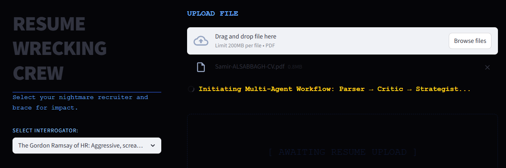
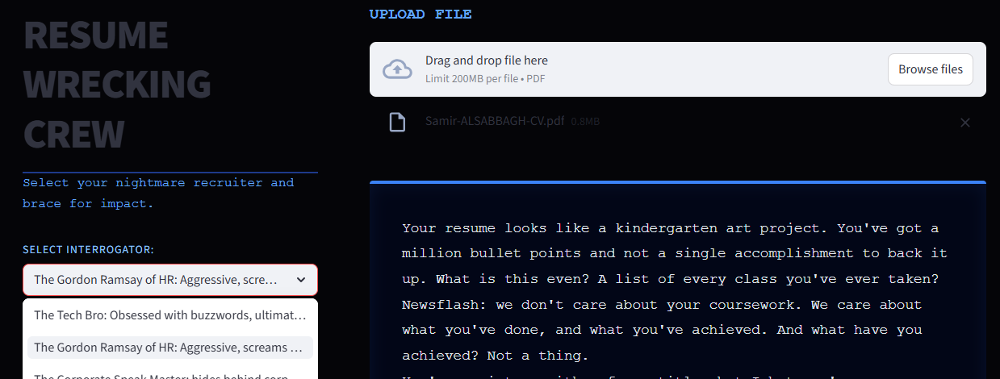
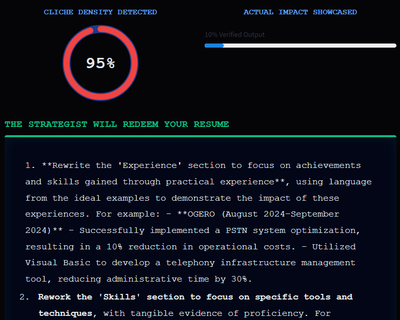

# 💀 Resume Wrecking Crew

A high-performance, **Multi-Agent AI application** that brutally critiques and strategically rebuilds unstructured resumes. Built with **DSPy**, **ChromaDB**, and **Streamlit**, this project orchestrates sequential LLM workflows and semantic search to deliver persona-driven feedback and actionable redemption strategies.

---

## 📸 Interface

### 1. The Multi-Agent Pipeline Initiation
Users upload a PDF and select an interrogator persona. The system immediately initiates the background workflow, passing data between discrete AI agents.

### 2. Persona-Driven Critique (The Roast)
The Critic Agent generates a scathing, highly contextual review of the candidate's experience, strictly adhering to the selected persona's tone (e.g., "The Gordon Ramsay of HR").

### 3. Real-Time NLP Metrics & RAG Redemption
The dashboard dynamically visualizes AI-extracted metrics (Cliché Density & Actual Impact). Finally, the Strategist Agent utilizes a local Vector Database to provide a 3-step roadmap, showing the user exactly how to rewrite their bullets using ideal examples.

---

## 🧠 System Architecture

This application moves beyond basic prompting by utilizing a **Sequential Multi-Agent Architecture** combined with **Retrieval-Augmented Generation (RAG)**. 

### The Three Agents (Orchestrated via DSPy):
1. **The Parser Agent:** 
   * **Role:** Data extraction and structuring.
   * **Function:** Ingests the raw, unformatted PDF text and strips away the noise, outputting a clean summary of the candidate's Skills, Experience, and Education.
2. **The Critic Agent:**
   * **Role:** Analysis and persona-driven generation.
   * **Function:** Ingests the parsed summary and the user's chosen persona. It generates the narrative roast and simultaneously calculates numerical NLP metrics (Cliché Density and Impact Scoring) used to drive the UI visualizations.
3. **The Strategist Agent (RAG-Powered):**
   * **Role:** Advice.
   * **Function:** Takes the Critic's harsh feedback and the original resume data, then queries a local *ChromaDB Vector Database* using semantic search. It retrieves synthetic "perfect" industry resume bullet points and uses them to formulate a strict, 3-step actionable roadmap for the user.

---

## 🛠️ Tech Stack

* **Front-End / UI:** Streamlit (Custom HTML/CSS/SVG integration)
* **AI Orchestration:** DSPy (Declarative Self-Improving Language Programs)
* **LLM API:** [Groq](https://groq.com/) (Running Llama-3.1-8b-instant for lightning-fast inference)
* **Vector Database (RAG):** ChromaDB
* **Data Processing:** PyPDF2, Sentence-Transformers

---

## 🌐 Try It Live

You can test the live application directly in your browser. Upload your CV and see the multi-agent RAG pipeline in action without installing anything locally.

👉 **[Try the Resume Wrecking Crew Here](https://resume-wrecking-crew-bdqbmvpgn6b2kvmrqzcmyy.streamlit.app/)**

*(Note: This application utilizes a free-tier LLM API. Occasional rate limits or brief cold-start loading times may apply).*